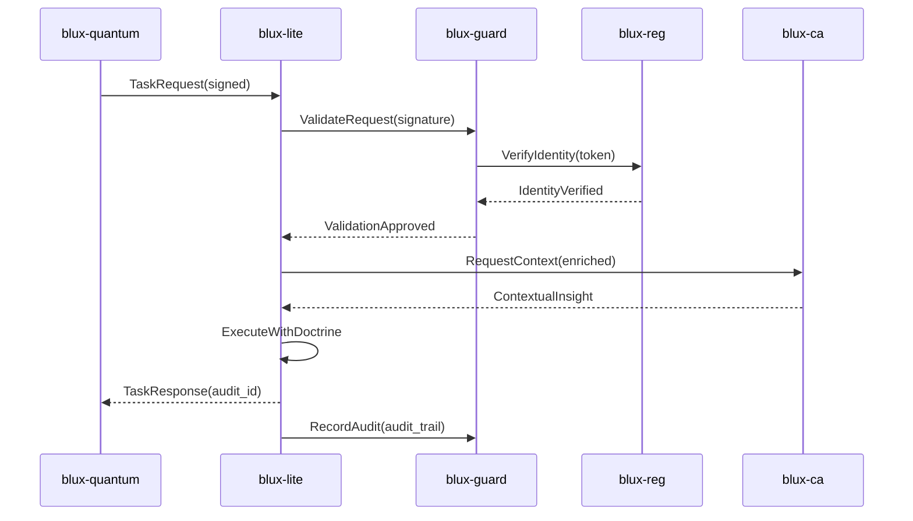

# BLUX Architecture

## System Overview

BLUX is a conversation between intelligences — a modular system of cooperating layers designed for coherence and coordination.

```mermaid
flowchart TB
    Hub[blux-ecosystem<br/>Gravitational Hub]:::hub
    
    subgraph Core Services
        Lite[blux-lite<br/>Orchestrator]:::core
        CA[blux-ca<br/>Conscious Layer]:::core
    end
    
    subgraph Security Foundation
        Guard[blux-guard<br/>Zero-Trust Security]:::shield
        Reg[blux-reg<br/>Identity & Keys]:::identity
    end
    
    subgraph Interface Layer
        Quantum[blux-quantum<br/>CLI/TUI]:::iface
        Commander[blux-commander<br/>Web UI]:::iface
    end

    Hub --> Core Services
    Hub --> Security Foundation
    Hub --> Interface Layer
    
    Lite <--> CA
    Lite <--> Guard
    Guard <--> Reg
    Quantum --> Lite
    Commander --> Lite
    
    %% Data Flow
    Reg -.->|Issues Keys| Guard
    Guard -.->|Validates| Lite
    CA -.->|Enriches| Lite
    Lite -.->|Audits| Guard

    classDef hub fill:#111,color:#fff,stroke:#6366f1,stroke-width:3px;
    classDef core fill:#1f2937,color:#fff,stroke:#3b82f6,stroke-width:2px;
    classDef shield fill:#0f172a,color:#fff,stroke:#22c55e,stroke-width:2px;
    classDef identity fill:#0a0a0a,color:#fff,stroke:#eab308,stroke-width:2px;
    classDef iface fill:#111827,color:#fff,stroke:#a855f7,stroke-width:2px;
```

## Inter-Module Protocols

Identity & Trust

· blux-reg: Issues and validates cryptographic identities
· blux-guard: Enforces zero-trust policies with signed manifests
· All inter-service calls require authenticated, time-bound tokens

Execution & Audit

· blux-lite: Routes tasks based on doctrine and capability
· blux-guard: Sandboxes execution (Docker/WASM/Firecracker)
· Append-only JSONL audits with cryptographic signatures

Conscious Reflection

· blux-ca: Enriches reasoning with contextual awareness
· Feeds doctrine-aligned insights back into routing decisions
· Maintains reflection logs linked to audit trails

Operator Interfaces

· blux-quantum: Terminal interface for deep integration
· blux-commander: Web dashboard for situational awareness
· Both surfaces provide real-time audit streaming

## Data Flow Patterns



## Deployment Topologies

Development (Single Host)

```
localhost:50050 - blux-reg
localhost:50051 - blux-lite  
localhost:50052 - blux-guard
localhost:50053 - blux-ca
localhost:50054 - blux-quantum
localhost:3000  - blux-commander
```

Production (Distributed)

```
reg.cluster.blux.example:443
lite.cluster.blux.example:443
guard.cluster.blux.example:443
ca.cluster.blux.example:443
```

---

Not louder — only clearer.  (( • ))

---