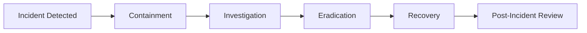

# Compliance Overview

## Regulatory Compliance

BLUX Ecosystem is designed to help organizations meet their regulatory obligations through built-in compliance features.

### Supported Regulations

| Regulation | Status | Key Features |
|------------|---------|--------------|
| **GDPR** | ✅ Fully Supported | Data subject access requests, right to be forgotten, data minimization |
| **CCPA/CPRA** | ✅ Fully Supported | Consumer privacy rights, data deletion, opt-out mechanisms |
| **HIPAA** | 🟡 Partial Support | Audit trails, access controls, encryption at rest (BAAs available) |
| **SOC 2** | 🟡 In Progress | Security controls, audit trails, access management |
| **FedRAMP** | 🔄 Planned | Government-grade security controls and documentation |

## Data Protection Features

### Privacy by Design
```yaml
data_minimization:
  enabled: true
  description: "Only collect and process necessary data"
  
purpose_limitation: 
  enabled: true
  description: "Data used only for specified purposes"

storage_limitation:
  enabled: true
  description: "Data retained only as long as necessary"
```

## Data Subject Rights

### Right to Access

```bash
# Export all user data
./tools/compliance-export.sh --user user123 --format json
```

### Right to Erasure

```bash
# Delete user data across all services
./tools/compliance-delete.sh --user user123 --confirm
```

### Data Portability

```bash
# Export data in standard format
./tools/compliance-export.sh --user user123 --format gdpr-json
```

## Audit & Documentation

### Compliance Evidence

BLUX maintains comprehensive audit trails that serve as evidence for compliance requirements:

```json
{
  "compliance_event": "data_access",
  "timestamp": "2025-10-20T10:30:00Z",
  "user_id": "user123",
  "data_categories": ["personal_data", "contact_info"],
  "purpose": "gdpr_access_request",
  "authorized_by": "compliance_automation",
  "audit_id": "aud_comp_123"
}
```

### Automated Reporting

```bash
# Generate compliance report
./tools/compliance-report.sh --period 2025-Q4 --regulation gdpr

# Create audit trail for regulators
./tools/audit-export.sh --format compliance --encrypt
```

## Security Controls

### Administrative Controls

· Role-based access control (RBAC)
· Multi-factor authentication (MFA)
· Regular security training and awareness
· Incident response procedures

### Technical Controls

· Encryption at rest and in transit
· Immutable audit trails
· Regular vulnerability scanning
· Secure development lifecycle

### Physical Controls

· Data center security (via cloud providers)
· Environmental controls
· Physical access logging

## Certification Status

### Current Certifications

· SOC 2 Type I: In progress (target Q2 2026)
· ISO 27001: Planned (target Q4 2026)
· HIPAA: Compliance framework available

## Self-Assessments

We regularly conduct internal assessments against:

· NIST Cybersecurity Framework
· CIS Critical Security Controls
· Cloud Security Alliance STAR

## Data Processing Agreements

### For Users

BLUX can function as either:

· Data Processor: When processing data on behalf of customers
· Data Controller: When managing its own operational data

Key Contractual Terms

· Data Processing Addendum (DPA): Available upon request
· Security Appendix: Detailed security controls
· Subprocessor List: Transparent list of third-party providers

## International Data Transfers

### Transfer Mechanisms

```yaml
european_economic_area:
  mechanism: "EU Standard Contractual Clauses"
  supplementary_measures: "Additional technical safeguards"
  
other_regions:
  mechanism: "Adequacy decisions or appropriate safeguards"
  documentation: "Transfer impact assessments available"
```

## Data Localization

BLUX supports data localization requirements through configurable storage regions:

```bash
# Configure data residency
export BLUX_DATA_REGION=eu-west-1    # EU data stays in EU
export BLUX_BACKUP_REGION=eu-central-1
```

## Incident Response

### Breach Notification

We commit to:

· Notifying affected parties within 72 hours of breach confirmation
· Providing clear information about the nature of the breach
· Outlining remediation steps being taken
· Cooperating with regulatory investigations

Response Timeline



## Compliance Documentation

Available Documents

· Data Processing Agreement
· Security Controls Matrix
· Privacy Impact Assessment
· Transfer Impact Assessment

Regular Updates

· Quarterly policy reviews
· Annual control assessments
· Continuous monitoring of regulatory changes

## Getting Started with Compliance

For Implementers

1. Review compliance requirements for your jurisdiction
2. Configure BLUX compliance settings appropriately
3. Document your data processing activities
4. Establish monitoring and reporting procedures

For Auditors

1. Request compliance documentation package
2. Review audit trails and security controls
3. Validate data processing configurations
4. Assess incident response capabilities

---

Compliance is not a destination, but a continuous journey.  (( • ))

Need specific compliance documentation? Contact compliance@outer-void.example

---