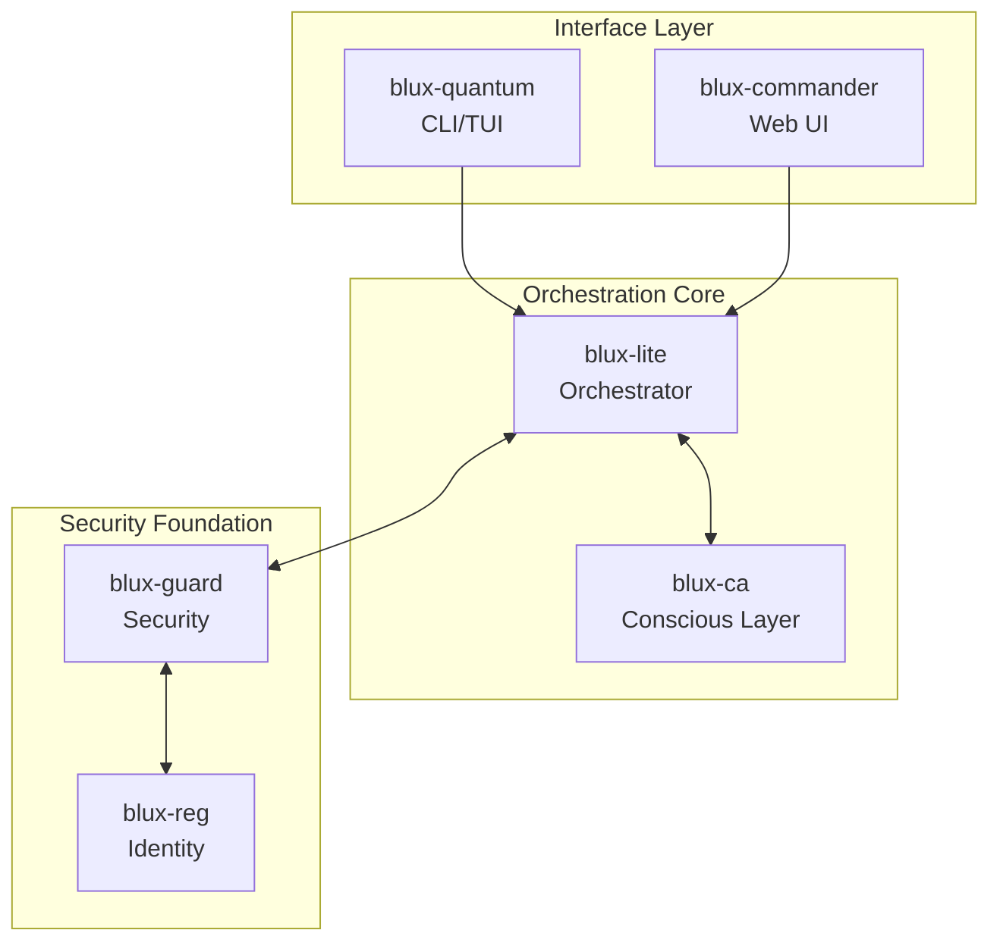
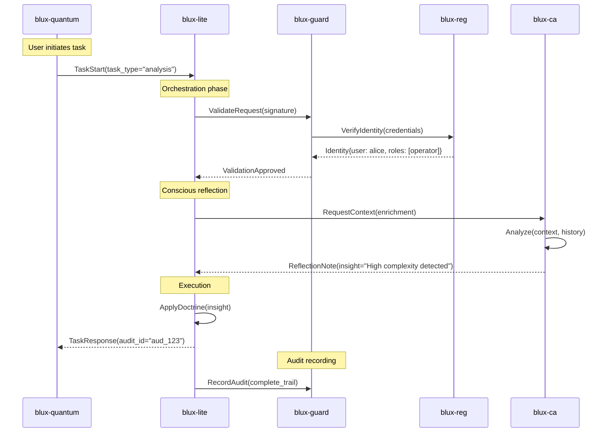

# BLUX Integration Guide

## Constellation Architecture

BLUX modules form a coordinated constellation where each service maintains autonomy while contributing to system coherence.



## Sibling Repositories

Module Purpose API Version Status
blux-lite Orchestration Core v1.2 🟢 Stable
blux-ca Conscious Intelligence v0.8 🟡 Alpha
blux-guard Security Enforcement v1.1 🟢 Stable
blux-reg Identity Management v1.3 🟢 Stable
blux-quantum Terminal Interface v0.9 🟡 Beta
blux-commander Web Dashboard v0.5 🟠 Early

## Event-Driven Integration

Core Event Types

```python
# events/base.py
class BLUXEvent:
    event_id: str
    timestamp: datetime
    source: str
    audit_id: str
    signature: str
    
class TaskStart(BLUXEvent):
    task_type: str
    context: Dict
    requirements: DoctrineRequirements

class RouteDecision(BLUXEvent):
    task_id: str
    selected_route: str
    rationale: str
    doctrine_flags: List[str]

class ReflectionNote(BLUXEvent):
    task_id: str
    insight: str
    confidence: float
    related_audit_ids: List[str]

class KeyRotate(BLUXEvent):
    key_id: str
    key_type: str
    rotation_reason: str
    valid_after: datetime
```

Event Flow Example



## API Integration Patterns

gRPC Services

```protobuf
// protos/orchestration.proto
service Orchestrator {
  rpc ExecuteTask(TaskRequest) returns (TaskResponse);
  rpc GetStatus(StatusRequest) returns (StatusResponse);
  rpc StreamAudit(StreamRequest) returns (stream AuditEvent);
}

service Security {
  rpc ValidateRequest(ValidationRequest) returns (ValidationResponse);
  rpc RecordAudit(AuditRecord) returns (AuditAck);
}

service Identity {
  rpc IssueToken(TokenRequest) returns (TokenResponse);
  rpc ValidateToken(TokenValidation) returns (TokenStatus);
}
```

RESTful Endpoints

```bash
# blux-lite orchestrator
POST /v1/tasks
GET  /v1/tasks/{id}
GET  /v1/status

# blux-guard security
POST /v1/validate
GET  /v1/policies
POST /v1/audit

# blux-reg identity
POST /v1/tokens
GET  /v1/identities/{id}
POST /v1/keys/rotate
```

## Data Exchange Formats

Task Request

```json
{
  "task_id": "task_abc123",
  "type": "data_analysis",
  "context": {
    "user_id": "user_alice",
    "environment": "production",
    "sensitivity": "high"
  },
  "doctrine_requirements": {
    "require_reflection": true,
    "sandbox_execution": true,
    "audit_level": "detailed"
  },
  "payload": {
    "operation": "analyze",
    "data_references": ["ref://data/set1"]
  },
  "signature": "es512-..."
}
```

Audit Record

```json
{
  "audit_id": "aud_xyz789",
  "timestamp": "2025-10-20T10:30:00Z",
  "service": "blux-lite",
  "operation": "task.execute",
  "identity": "user:alice@org",
  "input_hash": "sha256-...",
  "output_hash": "sha256-...",
  "doctrine_flags_applied": ["reflection_used", "sandboxed"],
  "related_events": ["task_start_123", "reflection_note_456"],
  "signature": "es512-..."
}
```

## Error Handling

Standard Error Response

```json
{
  "error": {
    "code": "VALIDATION_FAILED",
    "message": "Request signature invalid",
    "details": {
      "field": "signature",
      "issue": "expired_timestamp",
      "expected_format": "ES512 with valid timestamp"
    },
    "audit_id": "aud_err_123",
    "timestamp": "2025-10-20T10:30:00Z"
  }
}
```

Retry Strategies

```python
# Exponential backoff with jitter
def call_service_with_retry(service, request, max_retries=3):
    for attempt in range(max_retries):
        try:
            return service.call(request)
        except ServiceUnavailable as e:
            if attempt == max_retries - 1:
                raise
            sleep_time = (2 ** attempt) + random.uniform(0, 1)
            time.sleep(sleep_time)
```

## Security Integration

mTLS Configuration

```yaml
# mtls-config.yaml
tls:
  ca_cert: /etc/blux/certs/ca.pem
  cert_chain: /etc/blux/certs/service.pem
  private_key: /etc/blux/certs/service-key.pem
  verify_client: true
```

JWT Token Flow

```python
# Token acquisition and use
def get_service_token(service_name):
    claims = {
        "iss": "blux-reg",
        "sub": service_name,
        "aud": "blux-ecosystem",
        "exp": datetime.utcnow() + timedelta(hours=1),
        "scope": ["execute", "read_audit"]
    }
    return jwt.encode(claims, private_key, algorithm="ES512")
```

## Monitoring & Observability

Health Checks

```bash
# Service health
curl -f https://lite.blux.example:443/health

# Detailed status
curl https://lite.blux.example:443/status/detailed

# Metrics endpoint
curl https://lite.blux.example:443/metrics
```

Distributed Tracing

```python
# OpenTelemetry integration
from opentelemetry import trace

tracer = trace.get_tracer(__name__)

def execute_task(task):
    with tracer.start_as_current_span("task_execution") as span:
        span.set_attribute("task.id", task.id)
        span.set_attribute("user.id", task.user_id)
        # Task execution logic
```

## Testing Integration

Integration Test Setup

```python
# tests/integration/test_orchestration.py
class TestOrchestrationIntegration:
    @pytest.fixture
    async def blux_services(self):
        """Start all BLUX services for integration testing"""
        async with BLUXTestCluster() as cluster:
            yield cluster
    
    async def test_task_lifecycle(self, blux_services):
        task = TaskFactory.create()
        response = await blux_services.lite.execute_task(task)
        assert response.audit_id
        assert await blux_services.guid.verify_audit(response.audit_id)
```

Coordination births clarity.  (( • ))

---

Ready to integrate? See docs/examples/basic-integration.md for practical examples.

---