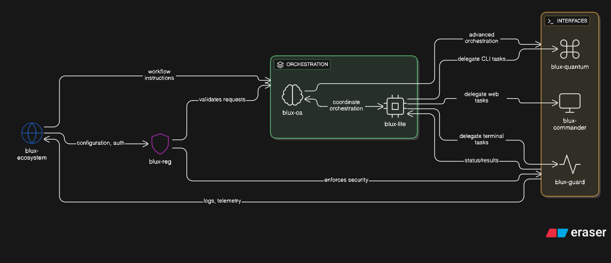

# BLUX Ecosystem Hub

[](LICENSE)
[](CONTRIBUTORS.md)
[](README.md)

Welcome to the **BLUX Ecosystem Hub**, the central repository for the BLUX Universe. BLUX is a self-sustaining system designed to heal, empower, and amplify positive impact. All core modules, integrations, and resources are housed here, making this the starting point for anyone engaging with BLUX.

---

## Mission Statement

BLUX builds systems that restore rather than deplete, empower rather than exploit, and endure rather than fade. Every component elevates those who integrate with it, ensuring impact radiates outward and grows over time.

---

## Integrated Ecosystem Diagram

<p align="center">
  
</p>

> This diagram illustrates how each module plugs into the BLUX Universe, creating a fully integrated, self-sustaining ecosystem.


## BLUX Modules

### Central Hub
**[blux-ecosystem](https://github.com/Outer-Void/blux-ecosystem)**  
_BLUX Universe Hub – central entry point_  


### Orchestration
**[blux-lite](https://github.com/Outer-Void/blux-lite)**  
_Hive-Mind AI Orchestrator – delegates tasks across BLUX modules_  


**[blux-ca](https://github.com/Outer-Void/blux-ca)**  
_Conscious AI Orchestrator – intended flagship_  


**[blux-quantum](https://github.com/Outer-Void/blux-quantum)**  
_bluxq-cli for BLUX Ecosystem_  


### Developer Interfaces
**[blux-guard](https://github.com/Outer-Void/blux-guard)**  
_BLUX Terminal Developer Cockpit_  


**[blux-commander](https://github.com/Outer-Void/blux-commander)**  
_BLUX Web Interface_  


### Authorization & Security
**[blux-reg](https://github.com/Outer-Void/blux-reg)**  
_Private Repo – BLUX Authorization System_  


---

## Core Principles

- **Healing over extraction** – Systems restore more than they consume.  
- **Sustainability over spectacle** – Growth is measured by resilience and long-term impact.  
- **Generational integrity** – Designed to endure, empowering future users.  
- **Mission over ego** – The focus is entirely on outcomes, not recognition.  
- **Amplification through integration** – BLUX multiplies the positive impact of everyone who engages with it.

---

## Integration Principles

- All modules plug into the Hub (`blux-ecosystem`) as the single source of truth.  
- Orchestration engines (`blux-lite`, `blux-ca`) delegate tasks across CLI, Web, and Dev Cockpit tools.  
- Authorization and security (`blux-reg`) governs access at every layer.  
- Future modules can be added seamlessly, maintaining mission alignment and ecosystem integrity.

---

## Getting Started

The **BLUX Ecosystem Hub** is located at `/blux-ecosystem`. To get started:

1. Clone the hub:

```bash
git clone git@github.com:Outer-Void/blux-ecosystem.git
```

2. Explore `/docs` for guides, integration points, and module documentation.  
3. Contribute in alignment with the mission: propose improvements, integrations, or modules that amplify positive impact.

---

## Quick Links

- [Modules](./modules) – Browse all core and community modules.  
- [Documentation](./docs) – Guides, setup instructions, and integration docs.  
- [Contributors](./CONTRIBUTORS.md) – See all contributors to the ecosystem.  
- [License](./LICENSE) – Apache 2.0 License information.

---

> BLUX shines on the mission and those who engage with it, not the creator. Its measure of success is tangible, lasting impact.


---
