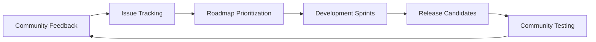

# BLUX Ecosystem Roadmap

> *Building coherence, one module at a time*

## 🎯 Vision

Create a constellation of intelligent services that work in harmony — where coordination beats concentration, and reflection precedes reaction.

## 🗓️ Release Timeline

### Q4 2025 - Foundation (Current)
- ✅ **v0.9.0-alpha**: Hub establishment with core documentation
- 🚧 **v0.9.1**: Docker Compose for local development
- 🔄 **v0.9.2**: Basic monitoring and health dashboards

### Q1 2026 - Coordination
- **v1.0.0**: First production-ready release
- **v1.1.0**: Advanced policy language and doctrine engine
- **v1.2.0**: Service mesh integration and advanced routing

### Q2 2026 - Intelligence  
- **v1.3.0**: Enhanced conscious layer with learning capabilities
- **v1.4.0**: Predictive routing and resource optimization
- **v1.5.0**: Advanced threat detection and autonomous response

### Q3 2026 - Ecosystem
- **v2.0.0**: Plugin system and extended integration points
- **v2.1.0**: Multi-cluster coordination and federation
- **v2.2.0**: Advanced analytics and insight generation

## 🎁 Upcoming Features

### Immediate (Next 3 Months)
```yaml
docker_compose:
  status: "in_progress"
  description: "Local development environment"
  target: "v0.9.1"

kubernetes_manifests:
  status: "planned" 
  description: "Production deployment templates"
  target: "v0.9.3"

advanced_monitoring:
  status: "planned"
  description: "Prometheus/Grafana integration"
  target: "v1.0.0"
```

### Near-term (3-6 Months)

```yaml
policy_language:
  status: "design"
  description: "Declarative security and routing policies"
  target: "v1.1.0"

service_mesh:
  status: "research"
  description: "Linkerd/Istio integration for advanced networking"
  target: "v1.2.0"

performance_optimization:
  status: "planned"
  description: "Caching, compression, and query optimization"
  target: "v1.2.0"
```

### Long-term (6+ Months)

```yaml
federated_learning:
  status: "concept"
  description: "Distributed learning across BLUX instances"
  target: "v2.0.0"

quantum_resistance:
  status: "research"
  description: "Post-quantum cryptography integration"
  target: "v2.1.0"

autonomous_operations:
  status: "vision"
  description: "Self-healing and self-optimizing capabilities"
  target: "v2.2.0"
```

## 🔬 Research Areas

Security & Privacy

· Homomorphic Encryption: Compute on encrypted data
· Zero-Knowledge Proofs: Verify without revealing
· Differential Privacy: Statistical insights with privacy guarantees

Intelligence & Coordination

· Multi-Agent Systems: Advanced coordination protocols
· Federated Learning: Collective intelligence without data centralization
· Predictive Analytics: Anticipate needs and optimize resources

Performance & Scalability

· Edge Computing: Distributed computation at the edge
· Stream Processing: Real-time data analysis
· Resource Optimization: Dynamic resource allocation

## 🌍 Community Goals

Growth Targets

· Q1 2026: 100+ GitHub stars, 10+ contributors
· Q2 2026: 500+ stars, production deployments
· Q4 2026: 1000+ stars, enterprise adoption

Ecosystem Expansion

· Plugin Marketplace: Community-contributed modules
· Integration Library: Pre-built connectors for common services
· Certification Program: Verified integrations and deployments

## 📊 Success Metrics

Technical Health

· Test coverage > 90%
· Zero critical security vulnerabilities
· < 30 minutes mean time to recovery
· 99.9% service availability

Adoption & Impact

· Active deployments in 10+ organizations
· Community-contributed plugins and integrations
· Positive impact on system coherence and operational efficiency

## 🤝 Contribution Opportunities

Immediate Needs

· Documentation improvements and examples
· Docker and Kubernetes deployment expertise
· Security review and penetration testing
· Performance benchmarking and optimization

Future Roles

· Module Maintainers: Own specific BLUX components
· Security Champions: Lead security reviews and improvements
· Integration Specialists: Build connectors to other systems
· Evangelists: Spread awareness and grow the community

## 🔄 Feedback Loop

We believe in building transparently with our community:



How to influence the roadmap?

1. Open issues with feature requests
2. Participate in discussions
3. Submit pull requests for desired features
4. Join community calls (starting Q1 2026)

---

The best way to predict the future is to create it.  (( • ))

Join us in building something extraordinary.

---