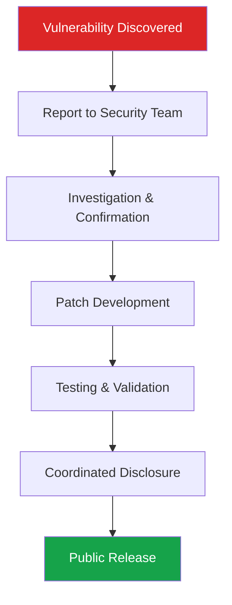

# Security Policy

## Supported Versions

We currently provide security updates for the following versions:

| Version | Supported          |
| ------- | ------------------ |
| 0.9.x   | :white_check_mark: |
| < 0.9.0 | :x:                |

## Reporting a Vulnerability

**Please do not report security vulnerabilities through public GitHub issues.**

Instead, please report them via email to **security@outer-void.example**.

You should receive a response within 48 hours. If for some reason you do not, please follow up via email to ensure we received your original message.

### What to Include

When reporting a vulnerability, please include:

- **Type of issue** (e.g., buffer overflow, SQL injection, cross-site scripting, etc.)
- **Full paths** of source file(s) related to the manifestation of the issue
- **Location** of the affected source code (tag/branch/commit or direct URL)
- **Special configuration** required to reproduce the issue
- **Step-by-step instructions** to reproduce the issue
- **Proof-of-concept or exploit code** (if possible)
- **Impact** of the issue, including how an attacker might exploit it

This information will help us triage your report more quickly.

## Security Update Process

1. **Report received** and acknowledged within 48 hours
2. **Investigation** begins immediately by security team
3. **Patch development** if vulnerability confirmed
4. **Testing** of patch across supported versions
5. **Disclosure** coordinated with reporter
6. **Release** of security update

We aim to provide patches for critical vulnerabilities within 72 hours of confirmation.

## Security Considerations

### Infrastructure Security
- All code is stored in encrypted repositories
- Access requires multi-factor authentication
- Regular security audits of infrastructure
- Dependencies are continuously monitored for vulnerabilities

### Development Security
- All commits must be signed
- Security reviews required for sensitive changes
- Automated security scanning in CI/CD pipeline
- Regular dependency vulnerability checks

### Operational Security
- Zero-trust network architecture
- mTLS between all services
- Immutable audit trails
- Regular key rotation

## Security Features

### Currently Implemented
- Cryptographic signing of all audit entries
- mTLS for inter-service communication
- Sandboxed execution environments
- Immutable JSONL audit trails
- Principle of least privilege enforcement

### Planned Enhancements
- Hardware security module (HSM) integration
- Advanced intrusion detection system
- Automated security incident response
- Supply chain security verification

## Responsible Disclosure

We follow a coordinated disclosure process:

### Disclosure Timeline

· Day 0: Vulnerability reported
· Day 2: Acknowledgement and investigation begins
· Day 5: Patch development if confirmed
· Day 10: Testing completed
· Day 14: Coordinated disclosure and release

## Security Advisories

Security advisories will be published in:

· GitHub Security Advisories
· Project documentation
· Release notes

## Bug Bounty Program

We currently do not have a formal bug bounty program. However, we greatly appreciate security researchers who responsibly disclose vulnerabilities. We acknowledge all valid security reports in our release notes.

## Additional Resources

· Security Overview - Detailed security architecture
· Architecture - System design and trust model
· Contributing Guidelines - Secure development practices

---

Security is not a feature; it's a foundation.  (( • ))

---