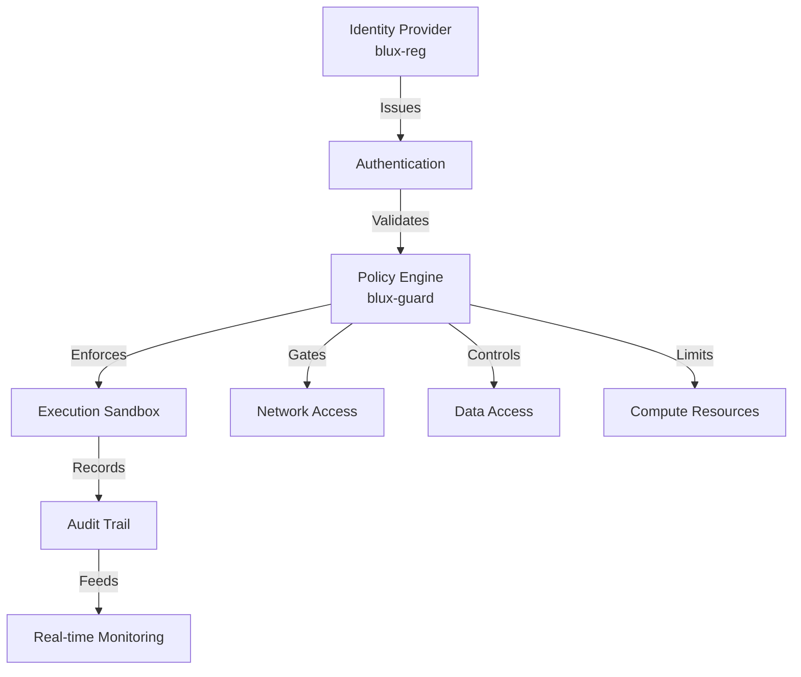

# BLUX Security & Trust Overview

## Core Security Principles

- **Zero-Trust Default**: Verify explicitly, trust nothing by default
- **Immutable Audits**: Append-only trails with cryptographic integrity
- **Local-First Memory**: Encrypted local storage with selective remote inference
- **Minimal Privilege**: Principle of least authority enforced system-wide

## Security Architecture



### Key Security Components

blux-reg: Cryptographic Identity

· Issues and manages X.509 certificates and JWTs
· Handles key rotation and revocation
· Provides mTLS for inter-service communication
· Maintains identity lifecycle

blux-guard: Policy Enforcement

· Sandboxing: Docker containers, WebAssembly, Firecracker microVMs
· Policy Gates: Runtime validation of all operations
· mTLS Enforcement: Service-to-service encryption
· JSONL Audits: Immutable operation records

blux-lite: Doctrine Enforcement

· Validates requests against active doctrine
· Routes based on security context
· Enforces data handling policies
· Coordinates security responses

blux-ca: Conscious Security

· Logs reflection rationale (secrets excluded)
· References audit IDs for traceability
· Provides security context awareness
· Enhances threat detection

## Audit System

Format Specification

```json
{
  "timestamp": "2025-10-20T10:30:00Z",
  "audit_id": "aud_abc123...",
  "service": "blux-lite",
  "operation": "task.execute",
  "identity": "user:alice@org",
  "signature": "es512-...",
  "data": {
    "input_hash": "sha256-...",
    "output_hash": "sha256-...",
    "doctrine_flags": ["reflection_required", "sandboxed"]
  }
}
```

Storage & Retention

· Location: ~/.config/blux/audit/ (configurable)
· Rotation: Size-based (1GB) and time-based (30 days)
· Offload: Hooks for cold storage (S3, GCS, etc.)
· Integrity: Cryptographic signing per entry

## Data Handling Compliance

PII Minimization

· Data classification at ingestion
· Automatic redaction in exports
· Selective field-level encryption

Privacy Regulations

· GDPR/CCPA deletion manifests
· Data subject request handling
· Cross-border transfer controls

Incident Response

· Automated security incident detection
· Forensic audit trail preservation
· Regulatory reporting automation

## Security Controls Matrix

Control Type Implementation Verification
Authentication mTLS, JWT blux-reg validation
Authorization Policy-based blux-guard enforcement
Audit JSONL + signing Cryptographic verification
Data Protection Encryption at rest Key rotation monitoring
Network Security Service mesh Traffic inspection

## Threat Model

Assumed Threats

· Compromised service credentials
· Malicious internal actors
· Supply chain attacks
· Data exfiltration attempts

Mitigations

· Short-lived credentials
· Behavioral anomaly detection
· Software bill of materials (SBOM)
· Data loss prevention policies

Integrity > approval; truth > comfort.  (( • ))

---

Need to report a security issue? See SECURITY.md for responsible disclosure.

---