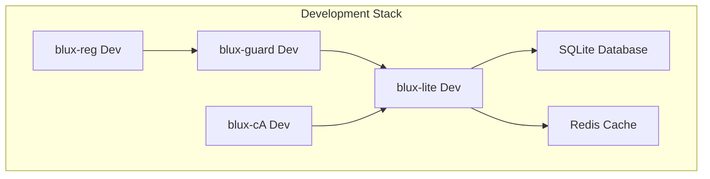

# Development Deployment Guide

## Quick Start

### Prerequisites
- Docker and Docker Compose
- Python 3.9+ or Node.js 18+
- Git

### One-Command Setup
```bash
git clone https://github.com/Outer-Void/blux-ecosystem.git
cd blux-ecosystem
./scripts/bootstrap.sh
```

Manual Setup

```bash
# Clone and setup
git clone https://github.com/Outer-Void/blux-ecosystem.git
cd blux-ecosystem

# Create Python virtual environment
python -m venv .venv
source .venv/bin/activate  # On Windows: .venv\Scripts\activate

# Install dependencies
pip install -r requirements.txt

# Setup development configuration
cp .env.example .env
cp config/development.yaml config/local.yaml

# Make scripts executable
chmod +x scripts/*.sh

# Verify setup
./scripts/health-check.sh
```

Development Architecture



Service Configuration

Development Environment Variables

```bash
# .env
BLUX_ENV=development
BLUX_AUDIT_PATH=./audit
BLUX_LOG_PATH=./logs
BLUX_DATA_PATH=./data

# Service endpoints
BLUX_REG_HOST=localhost:50050
BLUX_GUARD_HOST=localhost:50052
BLUX_LITE_HOST=localhost:50051
BLUX_CA_HOST=localhost:50053

# Development features
BLUX_DEV_MODE=true
BLUX_ENABLE_DEBUG=true
```

Development Configuration

```yaml
# config/development.yaml
environment: development

logging:
  level: debug
  format: pretty
  file: logs/blux-dev.log

security:
  require_authentication: false
  sandbox_execution: false  # Disable for faster development
  audit_all_operations: true

database:
  url: sqlite:///./data/blux-dev.db
  echo: true  # Log SQL queries

cache:
  url: redis://localhost:6379/0

services:
  blux_reg:
    host: localhost
    port: 50050
    debug: true
    
  blux_guard:
    host: localhost
    port: 50052
    debug: true
```

Running Services

Using Docker Compose

```bash
# Start all services
docker-compose -f docker-compose.dev.yml up -d

# View logs
docker-compose -f docker-compose.dev.yml logs -f

# Stop services
docker-compose -f docker-compose.dev.yml down
```

Manual Service Startup

```bash
# Terminal 1 - Identity Service
cd blux-reg
python -m blux_reg --port 50050 --debug

# Terminal 2 - Security Service  
cd blux-guard
python -m blux_guard --port 50052 --debug

# Terminal 3 - Orchestrator
cd blux-lite
python -m blux_lite --port 50051 --debug

# Terminal 4 - Conscious Layer
cd blux-ca
python -m blux_ca --port 50053 --debug
```

Development Tools

Hot Reload Setup

```bash
# Install development dependencies
pip install watchdog

# Start with hot reload
python -m watchdog observe . --recursive --command='pytest tests/ -x'
```

Debug Configuration

```python
# .vscode/launch.json
{
  "version": "0.2.0",
  "configurations": [
    {
      "name": "BLUX Lite Debug",
      "type": "python",
      "request": "launch",
      "program": "-m",
      "args": ["blux_lite", "--port", "50051", "--debug"],
      "env": {"BLUX_ENV": "development"}
    }
  ]
}
```

Testing Setup

```bash
# Run tests
pytest tests/ -v

# Run with coverage
pytest --cov=blux_ecosystem tests/

# Specific test categories
pytest tests/unit/ -v
pytest tests/integration/ -v
pytest tests/security/ -v
```

Development Workflow

1. Environment Setup

```bash
./scripts/bootstrap.sh
./scripts/health-check.sh
```

2. Development Cycle

```bash
# Create backup
./scripts/backup.sh --tag pre-feature-work

# Find anchors to modify
./scripts/anchor-list.sh

# Make changes within anchors
# ... edit code ...

# Test changes
./scripts/health-check.sh
pytest tests/ -x

# Create patch
git add .
git diff --cached > patches/$(date +%Y-%m-%d)-feature.patch
```

3. Integration Testing

```bash
# Start test environment
docker-compose -f docker-compose.test.yml up -d

# Run integration tests
pytest tests/integration/ -v

# Test API endpoints
curl http://localhost:50051/health
```

Common Development Tasks

Adding a New Service

1. Create service directory structure
2. Add to docker-compose.dev.yml
3. Update service discovery configuration
4. Add health check endpoints
5. Update documentation

Database Migrations

```bash
# Generate migration
alembic revision --autogenerate -m "add_feature_x"

# Apply migration
alembic upgrade head

# Rollback migration
alembic downgrade -1
```

API Development

```python
# Adding new API endpoint
# ANCHOR: api_task_creation
@app.post("/v1/tasks")
async def create_task(task_request: TaskRequest):
    # Validate request
    await validate_request(task_request)
    
    # Create audit entry
    audit_id = await create_audit_entry("task.create")
    
    # Process task
    result = await process_task(task_request)
    
    return TaskResponse(
        task_id=result.task_id,
        audit_id=audit_id,
        status="accepted"
    )
# ANCHOR_END: api_task_creation
```

Debugging Tips

Common Issues

Service Connection Refused

```bash
# Check if services are running
./scripts/health-check.sh

# Check service logs
docker-compose logs blux-lite
```

Database Issues

```bash
# Reset development database
rm -f data/blux-dev.db
alembic upgrade head
```

Dependency Conflicts

```bash
# Clear cache and reinstall
rm -rf .venv
python -m venv .venv
pip install -r requirements.txt
```

Performance Profiling

```python
import cProfile
import pstats

def profile_function():
    pr = cProfile.Profile()
    pr.enable()
    
    # Code to profile
    
    pr.disable()
    stats = pstats.Stats(pr)
    stats.sort_stats('cumulative')
    stats.print_stats(10)
```

Monitoring Development

Health Dashboard

```bash
# Start development dashboard
python -m blux_commander --dev --port 3000
```

Access at: http://localhost:3000

Log Monitoring

```bash
# Tail all logs
tail -f logs/*.log

# Filter for errors
grep -r "ERROR" logs/

# Structured log viewing
jq '.' logs/blux-dev.log | less
```

Metrics Collection

```bash
# Start metrics server
python -m blux_metrics --port 9090

# View metrics
curl http://localhost:9090/metrics
```

Production Simulation

Staging Environment

```bash
# Use production-like configuration
cp config/production.yaml config/staging.yaml

# Update environment
export BLUX_ENV=staging

# Run with production settings
./scripts/bootstrap.sh --staging
```

Load Testing

```bash
# Install load testing tools
pip install locust

# Run load test
locust -f tests/load_test.py
```

---

Development is exploration with purpose.  (( • ))

Next: Production Deployment Guide

---