<!-- DO NOT EDIT: generated from README.md via render_index_from_readme.py -->
<p align="center">
  
</p>

---

# BLUX Ecosystem — Gravitational Hub

> *Reflection > Reaction · Coordination > Concentration · Coherence > Complexity · Principles > Preferences*

**BLUX Ecosystem** is the central nervous system that orchestrates the BLUX constellation — where identity, trust, orchestration, consciousness, and safety converge into harmonious operation.


## 🎯 Core Philosophy

```python
# The BLUX Doctrine
PRINCIPLES = {
    "reflection_over_reaction": "Thoughtful response beats impulsive reaction",
    "coordination_over_concentration": "Distributed harmony beats isolated brilliance", 
    "coherence_over_complexity": "Elegant simplicity beats convoluted power",
    "principles_over_preferences": "Timeless truth beats temporary taste"
}
```

🚀 Instant Start

```bash
# Clone with all submodules
git clone --recurse-submodules https://github.com/Outer-Void/blux-ecosystem.git
cd blux-ecosystem

# One-command development environment
./scripts/bootstrap.sh

# Verify installation
./scripts/health-check.sh
```

🌌 The Constellation

Module Purpose Status Docs
BLUX Lite Orchestration Core 🟢 Operational API
BLUX cA Conscious Intelligence 🟡 Alpha Guide
BLUX Guard Zero-Trust Security 🟢 Stable Policy
BLUX Reg Identity & Keys 🟢 Stable Crypto
BLUX Quantum CLI/TUI Interface 🟡 Beta Quickstart
BLUX Commander Web Dashboard 🟠 Early UI Guide

📁 Enhanced Repository Structure

```
blux-ecosystem/
├── 📚 Documentation Hub
│   ├── README.md              # 🎯 This enhanced guide
│   ├── ARCHITECTURE.md        # 🏗️  System design & data flows
│   ├── SECURITY_OVERVIEW.md   # 🛡️  Zero-trust implementation
│   ├── CONFIG.md              # ⚙️  Multi-environment setup
│   ├── DEVELOPER_GUIDE.md     # 🛠️  Patch-first workflow
│   ├── INTEGRATION_GUIDE.md   # 🔗 Cross-module APIs
│   ├── CHANGELOG.md           # 📜 Release history
│   └── ROADMAP.md             # 🗺️  Future evolution
├── 🔐 Security & Compliance
│   ├── LICENSE                # 📄 Apache 2.0
│   ├── CODE_OF_CONDUCT.md     # 🤝 Community standards
│   ├── CONTRIBUTING.md        # 🎁 Contribution guidelines
│   ├── SECURITY.md            # 🚨 Vulnerability reporting
│   └── COMPLIANCE.md          # 🌍 GDPR/CCPA compliance
├── ⚡ Smart Scripts
│   ├── scripts/
│   │   ├── bootstrap.sh       # 🚀 One-shot environment setup
│   │   ├── health-check.sh    # ❤️  System verification
│   │   ├── anchor-list.sh     # 📍 Named edit locations
│   │   ├── patch-apply.sh     # 🩹 Safe patch application
│   │   ├── backup.sh          # 💾 State preservation
│   │   └── restore.sh         # 🔄 State recovery
│   └── tools/
│       ├── audit-analyzer.py  # 📊 JSONL audit analysis
│       ├── config-validator.py # ✅ Configuration validation
│       └── dependency-check.sh # 🔍 Security audit
├── 🛠️ Development
│   ├── .github/
│   │   ├── workflows/
│   │   │   ├── ci.yml         # 🔄 Continuous integration
│   │   │   ├── security.yml   # 🛡️ Security scanning
│   │   │   └── release.yml    # 🚀 Automated releases
│   │   ├── PULL_REQUEST_TEMPLATE.md
│   │   ├── ISSUES_TEMPLATE.md
│   │   └── SECURITY.md
│   ├── .gitignore
│   ├── .editorconfig
│   └── pre-commit-config.yaml
└── 📖 Deep Documentation
    ├── docs/
    │   ├── overview-diagram.md # 🎨 System visualization
    │   ├── api-gateway.md     # 🌐 Unified API reference
    │   ├── deployment/        # 🚢 Multi-environment guides
    │   ├── troubleshooting/   # 🐛 Common issues & solutions
    │   └── examples/          # 💡 Practical implementations
    └── manifests/
        ├── hub.manifest.json  # 📄 Static hub metadata
        └── policy.doctrine.json # 📜 Active doctrine flags
```

🎮 Quick Interaction

```bash
# Check system status
./scripts/health-check.sh

# List available anchors for development
./scripts/anchor-list.sh

# Create backup before changes
./scripts/backup.sh --tag pre-feature-x

# Analyze recent audit trails
python tools/audit-analyzer.py --last 1h
```

🔄 Development Flow

```mermaid
graph TD
    A[Fork & Branch] --> B[Backup State]
    B --> C[Edit Within Anchors]
    C --> D[Generate Patch]
    D --> E[Run Tests]
    E --> F[Health Check]
    F --> G[Create PR]
    G --> H[Automated Review]
    
    style A fill:#1a1a1a,stroke:#6366f1
    style H fill:#0f766e,stroke:#14b8a6
```



🛡️ Security First

```yaml
# Zero-Trust Defaults
security:
  identity_verification: required
  audit_trail: immutable
  local_memory: encrypted
  remote_inference: sandboxed
  data_retention: minimal
```

🌐 Network Topology

```bash
# Default Development Ports
BLUX_REG_HOST=localhost:50050      # Identity Service
BLUX_GUARD_HOST=localhost:50052    # Security Enforcer
BLUX_LITE_HOST=localhost:50051     # Orchestrator
BLUX_CA_HOST=localhost:50053       # Conscious Layer
BLUX_QUANTUM_HOST=localhost:50054  # CLI Interface
BLUX_COMMANDER_HOST=localhost:3000 # Web Dashboard

```

## 🧭 Unified Operator CLI — `bluxq`

`bluxq` is the single entrypoint for orchestrating, advising, enforcing, and governing the entire BLUX constellation. Every module ships a plugin that `bluxq` loads on demand so operators and automation pipelines speak with one voice.

```bash
# Discover available modules
bluxq modules list

# Run cross-module health checks
bluxq status --format table

# Invoke module specific commands
bluxq lite run --workflow resilience --env stage
bluxq guard audit --tail 50
bluxq commander dashboards list
```

PowerShell operators can use the same verbs:

```powershell
bluxq modules list
bluxq status --format table
bluxq guard audit --tail 50
```

Explore the full CLI surface in [`docs/modules/blux-quantum/README.md`](modules/blux-quantum/README.md).

## 📚 Enterprise Documentation Hub

- **Vision, Architecture, Operations:** curated under [`docs/`](./) with MkDocs-ready content.
- **Module Guides:** each module has dedicated pages under `docs/modules/<module>/` with overview, architecture, integration, operations, security, configuration, and command references.
- **Governance & Doctrine:** see [`docs/GOVERNANCE.md`](GOVERNANCE.md) and [`docs/modules/blux-doctrine/`](modules/blux-doctrine/) for policy stewardship.
- **Change Tracking:** hub-level updates live in [`docs/CHANGELOG.md`](CHANGELOG.md); module change logs remain in their home repos.

Serve the docs locally with:

```bash
python scripts/scan_subrepos.py
python scripts/render_index_from_readme.py
mkdocs serve
```

## 🔄 Documentation Automation Scripts

| Script | Purpose |
| --- | --- |
| `python scripts/scan_subrepos.py` | Discovers module repositories, ensures doc stubs exist, and refreshes the module index table. |
| `python scripts/gen_filetree.py` | Generates the repository tree for the README. |
| `python scripts/update_readme_filetree.py` | Injects the generated tree into the README between managed markers. |
| `python scripts/render_index_from_readme.py` | Rebuilds `docs/index.md` from the root README. |
| `python scripts/lint_links.py` | Emits warnings for broken Markdown links without failing builds. |

## 🌐 Documentation Site Pipeline

GitHub Actions workflow [`docs.yml`](../.github/workflows/docs.yml) builds the MkDocs Material site, publishes it to GitHub Pages, and runs the documentation automation scripts on every push to `main`.

## 📁 Repository File Tree

<!-- FILETREE:BEGIN -->
<!-- generated; do not edit manually -->
<details><summary><strong>Repository File Tree</strong> (click to expand)</summary>

```text
blux-ecosystem/
├── .editorconfig
├── .env.example
├── .github
│   ├── ISSUE_TEMPLATE.md
│   ├── ISSUES_TEMPLATE.md
│   ├── PULL_REQUEST_TEMPLATE.md
│   ├── SECURITY.md
│   └── workflows
│       ├── ci.yml
│       ├── docs.yml
│       ├── release.yml
│       └── security.yml
├── .gitignore
├── ARCHITECTURE.md
├── assets
│   ├── blux-eco-diag.png
│   ├── blux-eco-logo.png
│   ├── blux-lite-banner.png
│   └── outer-void-logo.png
├── CHANGELOG.md
├── CODE_OF_CONDUCT.md
├── COMPLIANCE.md
├── config
│   └── development.yaml
├── CONFIG.md
├── CONTRIBUTING.md
├── DEVELOPER_GUIDE.md
├── docs
│   ├── api-gateway.md
│   ├── ARCHITECTURE.md
│   ├── CHANGELOG.md
│   ├── CODE_OF_CONDUCT.md
│   ├── CONFIGURATION.md
│   ├── CONTRIBUTING.md
│   ├── development
│   │   ├── development.md
│   │   ├── kubernetes.md
│   │   └── production.md
│   ├── examples
│   │   ├── basic-integration.md
│   │   └── custom-module.md
│   ├── governance.md
│   ├── GOVERNANCE.md
│   ├── INSTALL.md
│   ├── links.md
│   ├── modules
│   │   ├── blux-ca
│   │   │   ├── API.md
│   │   │   ├── ARCHITECTURE.md
│   │   │   ├── CONFIGURATION.md
│   │   │   ├── INTEGRATION_GUIDE.md
│   │   │   ├── OPERATIONS.md
│   │   │   ├── README.md
│   │   │   └── SECURITY.md
│   │   ├── blux-commander
│   │   │   ├── API.md
│   │   │   ├── ARCHITECTURE.md
│   │   │   ├── CONFIGURATION.md
│   │   │   ├── INTEGRATION_GUIDE.md
│   │   │   ├── OPERATIONS.md
│   │   │   ├── README.md
│   │   │   └── SECURITY.md
│   │   ├── blux-doctrine
│   │   │   ├── API.md
│   │   │   ├── ARCHITECTURE.md
│   │   │   ├── CONFIGURATION.md
│   │   │   ├── INTEGRATION_GUIDE.md
│   │   │   ├── OPERATIONS.md
│   │   │   ├── README.md
│   │   │   └── SECURITY.md
│   │   ├── blux-guard
│   │   │   ├── API.md
│   │   │   ├── ARCHITECTURE.md
│   │   │   ├── CONFIGURATION.md
│   │   │   ├── INTEGRATION_GUIDE.md
│   │   │   ├── OPERATIONS.md
│   │   │   ├── README.md
│   │   │   └── SECURITY.md
│   │   ├── blux-lite
│   │   │   ├── API.md
│   │   │   ├── ARCHITECTURE.md
│   │   │   ├── CONFIGURATION.md
│   │   │   ├── INTEGRATION_GUIDE.md
│   │   │   ├── OPERATIONS.md
│   │   │   ├── README.md
│   │   │   └── SECURITY.md
│   │   ├── blux-quantum
│   │   │   ├── API.md
│   │   │   ├── ARCHITECTURE.md
│   │   │   ├── CONFIGURATION.md
│   │   │   ├── INTEGRATION_GUIDE.md
│   │   │   ├── OPERATIONS.md
│   │   │   ├── README.md
│   │   │   └── SECURITY.md
│   │   └── blux-reg
│   │       ├── API.md
│   │       ├── ARCHITECTURE.md
│   │       ├── CONFIGURATION.md
│   │       ├── INTEGRATION_GUIDE.md
│   │       ├── OPERATIONS.md
│   │       ├── README.md
│   │       └── SECURITY.md
│   ├── OPERATIONS.md
│   ├── PRIVACY.md
│   ├── ROADMAP.md
│   ├── SECURITY.md
│   ├── SUPPORT.md
│   ├── troubleshooting
│   │   ├── common-issues.md
│   │   └── debug-guide.md
│   ├── TROUBLESHOOTING.md
│   └── VISION.md
├── INTEGRATION_GUIDE.md
├── LICENSE
├── mkdocs.yml
├── pre-commit-config.yaml
├── README.md
├── ROADMAP.md
├── scripts
│   ├── anchor-list.sh
│   ├── backup.sh
│   ├── bootstrap.sh
│   ├── gen_filetree.py
│   ├── health-check.sh
│   ├── install.sh
│   ├── lint_links.py
│   ├── patch-apply.sh
│   ├── render_index_from_readme.py
│   ├── restore.sh
│   ├── scan_subrepos.py
│   └── update_readme_filetree.py
├── SECURITY.md
├── SECURITY_OVERVIEW.md
└── tools
    ├── audit-analyzer.py
    ├── config-validator.py
    └── dependency-check.sh
```

</details>
<!-- FILETREE:END -->

📈 Monitoring & Observability

```bash
# View real-time audit logs
tail -f ~/.config/blux/audit/*.jsonl | jq '.'

# Check service health
curl http://localhost:50051/health

# Trace request flow
JAEGER_ENDPOINT=http://localhost:14268/api/traces
```

🎯 What's Next?

1. Explore Architecture → ARCHITECTURE.md
2. Review Security Model → SECURITY_OVERVIEW.md
3. Setup Development → DEVELOPER_GUIDE.md
4. Understand Integration → INTEGRATION_GUIDE.md
5. Check Roadmap → ROADMAP.md

💫 Join the Constellation

```bash
# Star the repository to track evolution
gh repo watch Outer-Void/blux-ecosystem

# Join discussions
github.com/Outer-Void/blux-ecosystem/discussions

# Report security issues
security@outer-void.example
```

---

We build not for complexity, but for coherence. Not for control, but for coordination. The mountain awaits.  (( • ))

Ready to ascend? Start with ./scripts/bootstrap.sh to initialize your development environment.


## 🚀 Key Enhancements Delivered:

### **1. Professional Polish**
- Badges & visual hierarchy
- Status tables for module tracking  
- Enhanced file tree with emojis
- Modern documentation structure

### **2. Production Readiness**
- Health check scripts
- Configuration validation
- Audit analysis tools
- Security scanning workflows

### **3. Developer Experience**
- One-command bootstrap
- Interactive quick start
- Visual development workflow
- Comprehensive tooling

### **4. Operational Excellence**
- Monitoring guides
- Troubleshooting section
- Multi-environment support
- Compliance documentation

### **5. Community Building**
- Discussion links
- Contribution visibility
- Roadmap inclusion
- Security reporting

---
