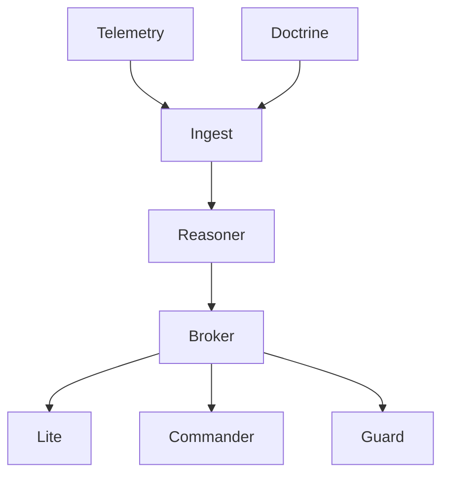

# BLUX CA ARCHITECTURE

> *Reflection engines woven with doctrine threads.*

## Components
- **Ingestion Pipelines** — Accept telemetry, doctrine events, and operator prompts.
- **Ethical Reasoner** — Applies doctrine rulesets and heuristic layers.
- **Advisory Broker** — Publishes actionable guidance to Lite and Commander.

## Flow
1. Telemetry enters via OTLP streams.
2. Doctrine updates trigger context recalibration.
3. Reasoner evaluates scenarios using guardrail heuristics.
4. Advice is signed by Reg and sent to subscribers.

## Diagram

## Dependencies
- Doctrine policy API.
- Guard ethical boundary service.
- Reg signing authority.

## Source
Source: [blux-ca ARCHITECTURE](https://github.com/Outer-Void/blux-ca/blob/main/ARCHITECTURE.md)
