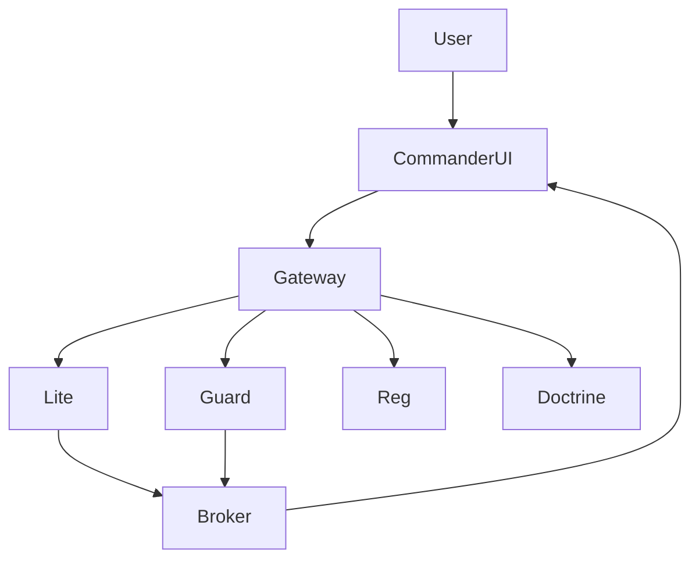

# BLUX COMMANDER ARCHITECTURE

> *Bridge of dashboards and APIs.*

## Components
- **Gateway** — Aggregates module APIs with capability enforcement.
- **Dashboard Service** — Renders panels defined via YAML.
- **Notification Engine** — Sends alerts to chat or email.
- **WebSocket Broker** — Streams telemetry updates.

## Flow

## Source
Source: [blux-commander ARCHITECTURE](https://github.com/Outer-Void/blux-commander/blob/main/ARCHITECTURE.md)
