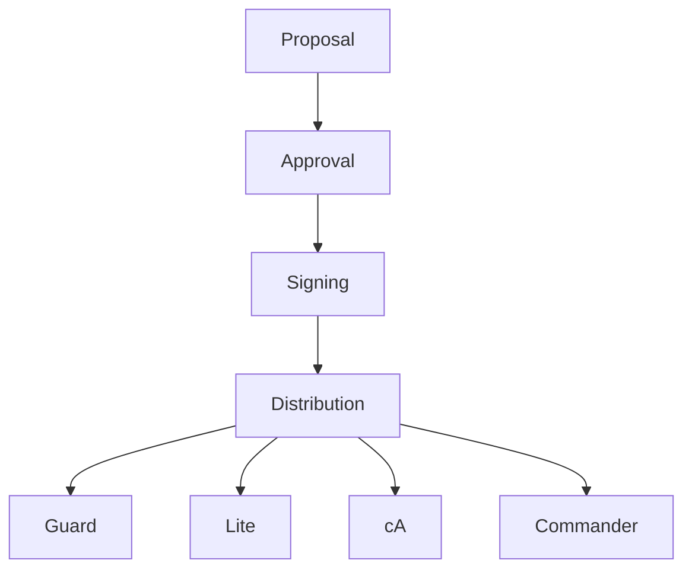

# BLUX DOCTRINE ARCHITECTURE

> *The moral spine of BLUX.*

## Components
- **Manifest Repository** — Git-backed or database-stored doctrine files.
- **Approval Engine** — Collects signatures from custodians.
- **Policy Service** — Serves doctrine context via REST/gRPC.
- **Audit Ledger** — Immutable log of doctrine changes.

## Flow
1. Proposal created via `bluxq doctrine propose`.
2. Approvals gathered from custodians.
3. Doctrine manifest promoted and signed by Reg.
4. Modules subscribe and refresh context.

## Diagram

## Source
Source: [blux-doctrine ARCHITECTURE](https://github.com/Outer-Void/blux-doctrine/blob/main/ARCHITECTURE.md)
