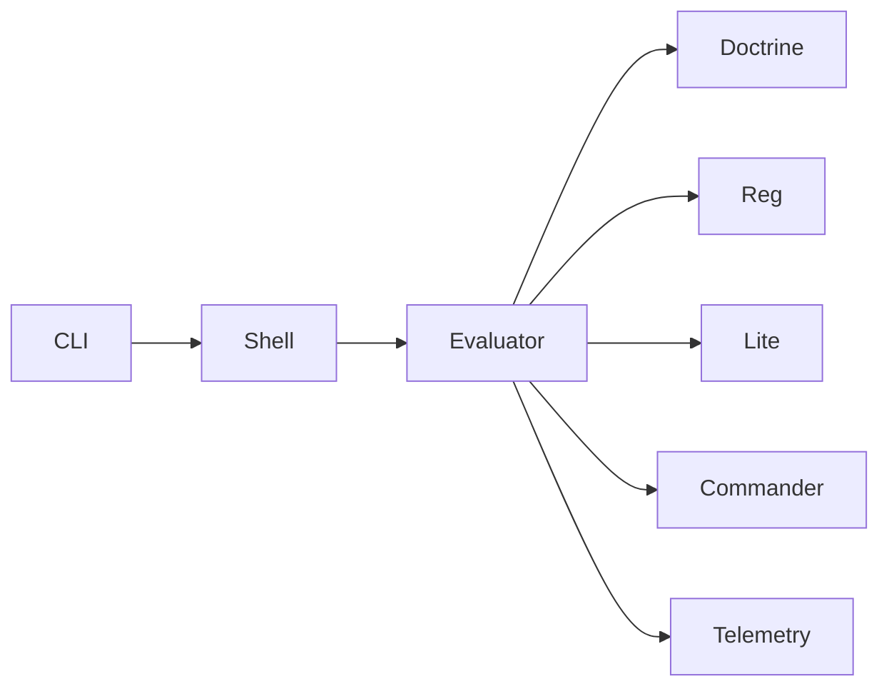

# BLUX GUARD ARCHITECTURE

> *Enforcement lattice woven around every command.*

## Components
- **Policy Evaluator** — Resolves doctrine rules and capability manifests.
- **Developer Shell Agent** — Injected shell enforcing command policies.
- **Telemetry Signer** — Seals enforcement results for audits.
- **Cockpit UI Adapter** — Pushes data to Commander dashboards.

## Flow
1. CLI command enters guard shell.
2. Evaluator checks doctrine and Reg capabilities.
3. Decision broadcast to Lite (if workflow) or Commander (if manual).
4. Telemetry signed and stored.

## Diagram

## Source
Source: [blux-guard ARCHITECTURE](https://github.com/Outer-Void/blux-guard/blob/main/ARCHITECTURE.md)
