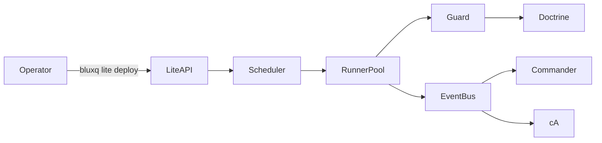

# BLUX LITE ARCHITECTURE

> *Workflow constellations orbit doctrine gravity.*

## Components
- **Ingress** — Receives workflow definitions via API or Git pushes.
- **Scheduler** — Prioritizes runs, respecting doctrine-defined guardrails.
- **Runner Pools** — Execute tasks in containerized sandboxes with Guard interceptors.
- **Event Bus** — Streams lifecycle events to Commander and cA.

## Data/Control Flows
1. Operators submit workflow manifests signed by Reg keys.
2. Lite validates manifests against Doctrine schema.
3. Guard intercepts each step; on approval, runner executes and emits telemetry.
4. Events propagate to Commander dashboards and cA advisory loop.

## Dependencies
- BLUX Reg for identity checks.
- BLUX Guard for enforcement.
- BLUX Doctrine for policy evaluation.
- Optional: External artifact stores referenced in tasks.

## High-Level Diagram

## Scaling
- Horizontal scaling by adding runner nodes defined in `config/modules/lite.yaml`.
- Use `bluxq lite scale --pool <name> --size <n>` for dynamic adjustments.

## Source
Source: [blux-lite ARCHITECTURE](https://github.com/Outer-Void/blux-lite/blob/main/ARCHITECTURE.md)
