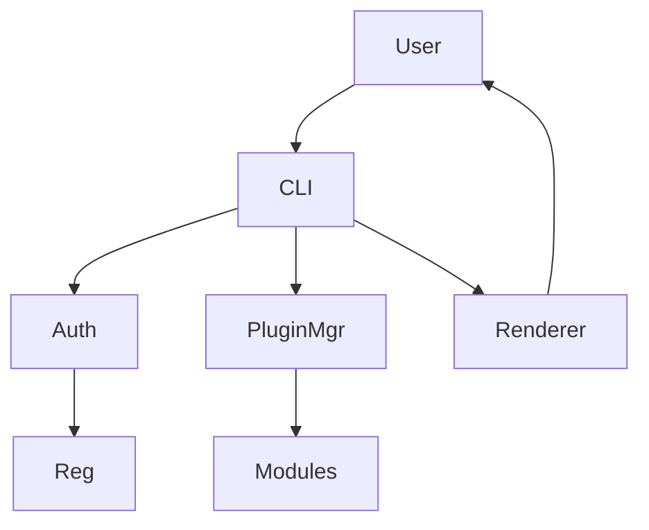

# BLUX QUANTUM ARCHITECTURE

> *A gateway CLI with modular gravity.*

## Layers
- **Bootstrap** — Auth handshake with Reg and Guard.
- **Plugin Manager** — Discovers module packs in `~/.blux/plugins` or repo.
- **Transport** — REST/gRPC clients for modules.
- **Renderer** — Formats output (table, json, yaml) for automation.

## Flow

## Extensibility
- Plugins declared via `bluxq-plugin.yaml` manifest.
- Supports Python entry points and shell wrappers.

## Source
Source: [blux-quantum ARCHITECTURE](https://github.com/Outer-Void/blux-quantum/blob/main/ARCHITECTURE.md)
