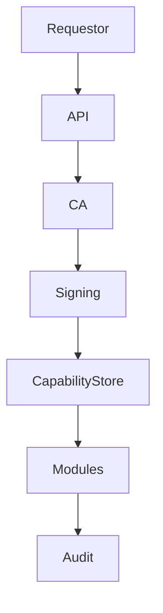

# BLUX REG ARCHITECTURE

> *The trust foundry.*

## Components
- **Certificate Authority** — Issues TLS certificates and JWTs.
- **Capability Registry** — Stores module permissions.
- **Audit Trail** — Immutable log replicating to secure storage.

## Flow

## Source
Source: [blux-reg ARCHITECTURE](https://github.com/Outer-Void/blux-reg/blob/main/ARCHITECTURE.md)
